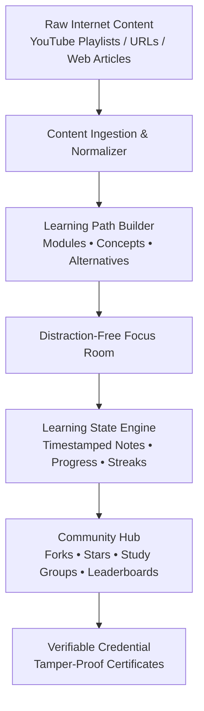

```text
  ___                    _                          
 / _ \ _ __   ___ _ __  | |    ___  __ _ _ __ _ __  
| | | | '_ \ / _ \ '_ \ | |   / _ \/ _` | '__| '_ \ 
| |_| | |_) |  __/ | | || |__|  __/ (_| | |  | | | |
 \___/| .__/ \___|_| |_||_____\___|\__,_|_|  |_| |_|
      |_|                                           
```

<p align="center">
  <strong>The Open Curriculum Layer for the Internet — Turn Scattered Videos into Finished Learning.</strong>
</p>

<p align="center">
  <a href="#the-revolution--why-this-matters">Why This Matters</a> •
  <a href="#what-is-openlearn">What is OpenLearn?</a> •
  <a href="#core-innovations">Core Innovations</a> •
  <a href="#how-it-compares">How It Compares</a> •
  <a href="#product-architecture">Product Architecture</a> •
  <a href="#roadmap">Roadmap</a> •
  <a href="#contributing">Contributing</a>
</p>

<p align="center">
  
  
  
  
</p>

---

## 🌟 The Revolution: Why This Matters

YouTube holds the greatest repository of educational content ever created by humanity. World-class professors, independent engineers, researchers, and polymaths publish explanations that rival top university lectures.

**Yet, less than 3% of self-directed online learners actually finish what they start.**

### Why does internet learning fail?

```text
The Traditional YouTube Trap:
  Search Topic ──> Find Playlist ──> Algorithmic Recommendation ──> Rabbit Hole ──> Context Lost ──> Abandoned
```

1. **The Engagement Trap vs. The Learning Goal**: Mainstream platforms are engineered to maximize session time and ad impressions through autoplay, related videos, clickbait thumbnails, and comment doomscrolling — the exact opposite of deep cognitive flow.
2. **Playlists Are Not Curricula**: A chronological YouTube playlist cannot model prerequisite hierarchies, modular concepts, or multi-creator explanations.
3. **One Creator Rarely Explains Everything Best**: You might love Creator A’s explanation of Linear Algebra, but need Creator B’s intuitive animation for Backpropagation.
4. **No Git for Knowledge**: When someone discovers an outdated lecture, a dead link, or a better explanation, they cannot "fork" or improve the curriculum for the next person.

> **OpenLearn is here to change the paradigm:**  
> We do not build another place where people mindlessly consume content.  
> **We build a place where people finish learning — and then help the next learner finish faster.**

---

## 💡 What is OpenLearn?

**OpenLearn** is a free, open-source, community-powered learning platform designed for enthusiasts, students, and self-directed builders who want to learn from YouTube and the open web without distractions.

It converts raw YouTube playlists, scattered URLs, or lecture notes into **structured, forkable, and social learning paths**. Inside our dedicated **Focus Room**, you study without algorithmic interference, take timestamped markdown notes, sync progress across devices, collaborate in peer study groups, and earn verifiable completion credentials.

OpenLearn is **more than an LMS** (Learning Management System):
- Traditional LMS platforms are closed gardens with paywalls, rigid syllabi, and outdated video catalogs.
- OpenLearn treats the entire public internet as the campus, providing the **open curriculum and focus layer** that turns raw web content into an interactive university.

---

## 🚀 Core Innovations

### 1. 🎯 Distraction-Free Focus Room
Experience YouTube transformed into a dedicated deep-work laboratory:
- **Zero Algorithmic Noise**: No recommended feeds, no sidebar suggestions, no comment section traps.
- **Embedded Player Integration**: Official YouTube IFrame Player integration respecting creator views while shielding your attention.
- **Automatic Resume**: Pick up at the exact second where you left off across any device.
- **Timestamped Markdown Notes**: Take synchronized notes that link directly to video moments, exportable to Markdown, Notion, or Obsidian.

### 2. 🗺️ Learning Paths: Concepts Over Playlists
Unlike flat playlists, an OpenLearn curriculum is organized hierarchically:
```text
Deep Learning Path (OL-8F39A)
├── Module: Foundations
│   ├── Concept: Linear Algebra (3Blue1Brown)
│   └── Concept: Vector Calculus (Khan Academy)
└── Module: Neural Networks
    └── Concept: Backpropagation
        ├── Primary Explanation: StatQuest
        ├── Alternative Explanation: Andrej Karpathy
        └── Interactive Resource: Distill.pub Article
```
- **Alternative Explanations**: If one creator’s explanation doesn't click, switch to a community-vetted alternative without losing your curriculum progress.
- **Multi-Source Curricula**: Combine YouTube lectures, GitHub repos, research papers, and technical articles into one coherent syllabus.

### 3. 🌿 Forkable Curricula (Git for Learning)
Just like software evolves on GitHub, learning paths evolve on OpenLearn:
- **Fork Any Path**: Find a machine learning curriculum you like? Fork it, swap in updated lectures, reorder the modules, and tailor it to your needs.
- **Lineage Tracking**: Every path maintains its provenance (`Path A` → `Fork B` → `Fork C`), giving credit to original curators while surfacing community innovations.
- **Community Upvoting & Stars**: High-quality, verified learning journeys rise to the top of search results.

### 4. ⚡ Gamification & Peer Accountability
Learning alone is hard; learning together creates momentum:
- **Learning XP & Streaks**: Earn rewards for actual study milestones and concept completions — never for passive idle time.
- **Study Groups**: Create private or public cohorts to learn a subject together with shared group leaderboards.
- **Global Leaderboards**: Measure your consistency against learners worldwide.

### 5. 🎓 Verifiable Proof of Completion
- Complete approved OpenLearn community paths to receive a **verifiable completion certificate**.
- Includes a tamper-proof cryptographic ID and public QR code shareable on LinkedIn, GitHub, or resumes.

---

## 📊 How It Compares

| Feature | OpenLearn | Native YouTube | Traditional LMS (Coursera/Udemy) | Browser Blocker Extensions |
| :--- | :---: | :---: | :---: | :---: |
| **Cost & Openness** | **100% Free & Open Source** | Free (Ad-supported) | Paid / Paywalled | Free / Freemium |
| **Distraction Elimination** | **Complete Focus Room** | None (Built for retention) | Moderate | Partial (Hides elements) |
| **Curriculum Structure** | **Modules + Concepts + Alts** | Flat Linear Playlist | Locked Rigid Syllabi | Flat Linear Playlist |
| **Concept Alternatives** | **Yes (Switch creators)** | No | No | No |
| **Curriculum Forking** | **Yes (Git-style lineage)** | No | No | No |
| **Timestamped Markdown Notes** | **Built-in & Exportable** | No | Basic text | Third-party extensions |
| **Community Curated** | **Yes (Global collaboration)** | Creator-only | Institution-only | N/A |
| **Study Groups & Streaks** | **Built-in** | No | Limited | No |

---

## 🛠️ Product Architecture

OpenLearn is architected as an open, modular ecosystem:



### The Core Loop
1. **Import**: Paste a YouTube playlist, multiple video URLs, or article links.
2. **Structure**: Organize content into modules, define concepts, and attach alternative explanations.
3. **Focus**: Study in the Focus Room with automatic timestamped note-taking and playback memory.
4. **Publish & Fork**: Share your path with the world; let other learners fork and elevate the curriculum.

---

## 🗺️ Roadmap & Milestones

- [ ] **Phase 1: Foundation (Core Focus Engine)**
  - YouTube playlist & multiple URL parser
  - Distraction-Free Focus Room with embedded player
  - Timestamped note-taking with Markdown preview & export
  - Local & authenticated progress persistence (resume state)
- [ ] **Phase 2: Curriculum & Community**
  - Learning Path Builder (Modules, Concepts, and Primary/Alternative resources)
  - Public learning path directory with SEO-friendly routes
  - Forking engine with lineage tracking
  - User profiles, stars, and follows
- [ ] **Phase 3: Gamification & Social Learning**
  - XP engine, streaks, and milestone badges
  - Cohort-based study groups & group leaderboards
  - Approved path completion certificates with public QR verification
- [ ] **Phase 4: Ecosystem Expansion**
  - Support for additional content providers (articles, docs, podcasts)
  - Visual note & diagramming canvas integrations
  - Educational micro-learning and concept flashcards

---

## 🤝 Contributing: Build the Future of Learning

OpenLearn is built in public, for the public. We believe the future of global education belongs to the open-source community, not behind paywalls or algorithmic feeds.

Whether you write code, design interfaces, or curate world-class playlists, **there is a place for you here**.

### How You Can Help

- 🎓 **Curators & Learners**: Help us design benchmark learning paths for Computer Science, Mathematics, Machine Learning, Design, and Philosophy. Propose paths via our [Curriculum Proposal Template](https://github.com/SriSatyaLokesh/open-learn/issues/new?template=curriculum_proposal.md).
- 💻 **Developers**: Build the Focus Room player, curriculum builder, database schema, and ingestion adapters.
- 🎨 **UI/UX Designers**: Design clean, distraction-free interfaces, study room ergonomics, and gamification feedback loops.
- 📝 **Technical Writers & Translators**: Improve our documentation, contribute to architectural decision records, or translate OpenLearn for global learners.

To get started, please review:
- 📖 [Contributing Guidelines](CONTRIBUTING.md)
- 📜 [Code of Conduct](CODE_OF_CONDUCT.md)
- 📐 [Product Requirements Document (PRD)](docs/OPENLEARN_PRD.md)

---

## 📜 License

OpenLearn is open-source software licensed under the [MIT License](LICENSE).

---

<p align="center">
  <strong>Stop scrolling. Start finishing.</strong><br>
  Built with ❤️ by the OpenLearn community.
</p>
