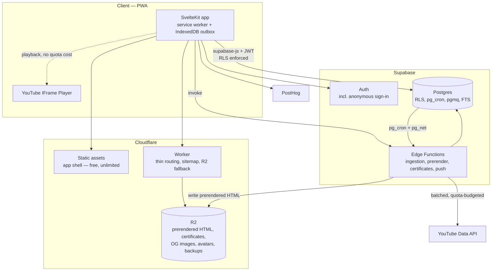
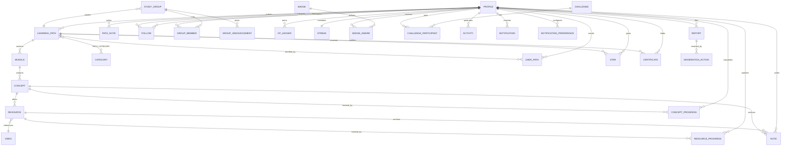
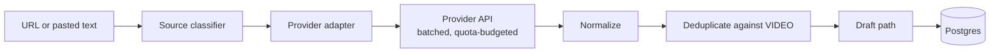
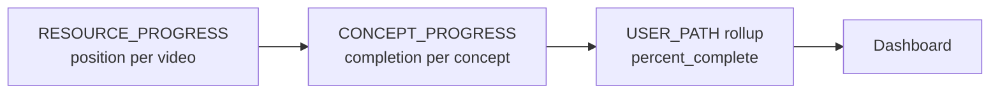

# OpenLearn — Architecture

**Version:** 2.0
**Date:** 27 September 2026
**Supersedes:** v1.0
**Companion documents:** [`ARCHITECTURE_REVIEW.md`](./ARCHITECTURE_REVIEW.md) (why v1 changed), [`DATABASE.md`](./DATABASE.md), [`COST.md`](./COST.md), [`YOUTUBE_INTEGRATION.md`](./YOUTUBE_INTEGRATION.md), [`ADR/`](./ADR/)

---

## 1. Overview

OpenLearn turns scattered internet learning content — YouTube first — into structured, forkable **learning paths**, and helps people finish them. The product is defined in [`OPENLEARN_PRD.md`](./OPENLEARN_PRD.md); this document describes how it is built.

The central object is the learning path: `Path → Module → Concept → Resource`, where a concept may hold one primary and several alternative explanations of the same idea. Everything else — the Focus Room, progress, notes, gamification, groups, forking, certificates — hangs off that spine.

### 1.1 Design philosophy

1. **Zero-cost by construction, not by discipline.** The architecture removes unbounded resources from the metered path rather than trying to stay under limits. Public pages are prerendered files served from object storage, so a viral page consumes no metered resource at all. See §5.
2. **Postgres first, vendors last.** Queues, schedules, search, rate limiting and leaderboards are all Postgres features. Four vendors total. A fifth needs a measured reason.
3. **The database is the security boundary.** Authorization lives in Row Level Security policies, not in application code that must remember to check. See §7.
4. **The learner chooses what to learn; OpenLearn helps them finish it.** No unrelated discovery feeds inside the study experience.
5. **Provider abstraction.** YouTube is behind an adapter because policy and API changes are the product's top risk (PRD §47).
6. **Gamification without dependency.** XP attaches to OpenLearn learning events. The event-type enum makes rewarding third-party watch time structurally impossible, not merely discouraged. See §12.
7. **The host is a deploy target, not a dependency.** No host-proprietary APIs. All server compute is in Supabase Edge Functions, all scheduling in `pg_cron`.

---

## 2. Constraints

Non-functional requirements that shaped every decision below. They are listed first because several of them eliminate otherwise-reasonable designs.

| # | Constraint | Source | Consequence |
|---|---|---|---|
| C1 | **$0.00/month.** Not "cheap" — zero. | Owner | Every vendor is on a free tier; `COST.md` tracks the budget and tripwires. |
| C2 | Hosting on **Cloudflare**; files on **R2**; database/auth on **Supabase**. | Owner | See C3. |
| C3 | **Cloudflare Workers Free caps CPU at 10 ms per invocation** — a hard kill (Error 1102), not a throttle. | [Workers limits](https://developers.cloudflare.com/workers/platform/limits/) | The single most consequential constraint. It rules out React Server Component rendering, and it means **no meaningful server work may happen in the host layer at all.** |
| C4 | **PWA** — installable, offline-capable, responsive for mobile and desktop. One codebase. | Owner | §18. |
| C5 | Open source, contribution-ready; a newcomer must reach a running app with no paid account and no API key. | PRD §44 | §21. Drives the repo structure and the mocked YouTube adapter. |
| C6 | Modular monolith; must reach millions of users without a domain-model rewrite. | PRD §45 | Module boundaries enforced by lint, not by package publishing. |
| C7 | **SEO is a product feature**, and public pages are created continuously by users. | PRD §32 | Build-time-only static generation is insufficient. §5. |
| C8 | YouTube Developer Policies are binding: 30-day data retention, player must be ≥200×200 and unobscured, no incentivising watching. | [Developer Policies](https://developers.google.com/youtube/terms/developer-policies) | `YOUTUBE_INTEGRATION.md`; constrains the data model (§6) and the mobile layout (§18). |
| C9 | Accessibility, including a **keyboard alternative to drag-and-drop**. | PRD §38 | §17. A hard requirement on the Path Builder. |

---

## 3. Technology stack

| Layer | Choice | Why |
|---|---|---|
| Framework | **SvelteKit** + TypeScript | SSR is string concatenation and reportedly stays well under C3's 10 ms ceiling; one paradigm covers both public content and the rich app. See [`ADR/0001b`](./ADR/0001b-framework.md). |
| Styling | Tailwind CSS | Utility-first, no runtime cost, mobile-first by default. |
| Hosting | Cloudflare Workers + static assets | Static asset serving is free and unlimited. |
| Object storage | Cloudflare R2 | 10 GB, free egress, no file-count ceiling. Holds prerendered pages, certificates, OG images, avatars, backups. |
| Database | Supabase Postgres | With `pg_cron`, `pgmq`, `pg_trgm`, full-text search. |
| Auth | Supabase Auth (`@supabase/ssr`) | Includes anonymous sign-in, which is how Guest Mode works (§16). |
| Data access | `supabase-js` for user-scoped work; **Drizzle for types and service-role queries only** | RLS must be enforced by the database. See §7 and [`ADR/0002`](./ADR/0002-data-access-and-rls.md). |
| Migrations | Supabase CLI plain-SQL migrations | Single source of truth for DDL **plus** policies, triggers, functions and cron jobs. Drizzle schema stays in sync via `drizzle-kit pull`. |
| Server compute | Supabase Edge Functions (Deno) | 150 s, 500k/month. All ingestion, prerendering, certificates, push. |
| Scheduling | `pg_cron` | Minute-level. Cloudflare's cron is bound by C3. |
| Queue | Supabase Queues (`pgmq`) | For work that must survive a crash. Handlers are idempotent. |
| Client state | Svelte stores + IndexedDB outbox | §18. |
| Drag & drop | `svelte-dnd-action` | Has keyboard and ARIA support (labelled beta — must be screen-reader tested; see C9 and §17). |
| Analytics & errors | PostHog | Free plan covers both, with unlimited seats. |
| Traffic stats | Cloudflare Web Analytics | Free, and does not consume the Worker quota. |
| Abuse | Cloudflare Turnstile + a Postgres rate limiter | §16. |
| CI, backups, keepalive | GitHub Actions | Unlimited for public repos. |

**Deliberately not used:** Next.js/React (C3), Vercel, Inngest/Trigger.dev, Upstash Redis, Sentry, Supabase Storage, ElectricSQL/PowerSync/Zero/RxDB, any dedicated search service. Each has a revisit condition in §22.

---

## 4. System architecture



Four things to notice, because they are the whole design:

1. **Public page views never reach Supabase or run any code.** They are files in R2 served through Cloudflare's CDN. This is why C1 holds and why public pages survive a database outage.
2. **The browser talks to Postgres directly** via `supabase-js` with the user's JWT, and RLS enforces access. There is no bespoke API layer to keep in sync.
3. **All server-side compute is in Edge Functions**, not the host — forced by C3 and beneficial anyway: it makes the host swappable.
4. **`pg_cron` drives scheduled work**, reaching Edge Functions via `pg_net`. Nothing is scheduled on the host.

---

## 5. Rendering strategy

This section exists because C3 and C7 are in direct tension: SEO requires server-rendered HTML for an unbounded, continuously growing set of pages, while the host allows 10 ms of CPU per request.

**Resolution: public pages are rendered once, off the request path, and stored as files.**

When a path is published or edited, an Edge Function (150 s, no CPU ceiling) renders complete HTML — title, meta description, canonical URL, Open Graph tags, JSON-LD `Course` schema — and writes it to R2. Cloudflare serves it as a static asset. **Nothing renders at request time**, so Error 1102 is structurally impossible for public traffic regardless of how many paths exist or how popular one becomes.

### 5.1 Strategy per page class

| Page class | Strategy | Indexed |
|---|---|---|
| Landing, about, category index | Prerendered at build | Yes |
| **Public path page, public profile, certificate verification** | **Prerendered on publish/edit into R2**; invalidated on change | Yes |
| Sitemap | Worker route querying Postgres, streamed | — |
| Dashboard, Path Builder, Focus Room, group pages | Client-rendered, `noindex` | No |

Client-side rendering is correct for the authenticated app and wrong for public pages: Googlebot renders JavaScript in a second, queued pass that can lag for days and fails silently at scale, and Google advises against dynamic rendering. Public pages therefore ship as complete HTML; the app shell does not need to.

### 5.2 Implementation notes

- **Prerendered pages live in R2, not the build output.** Workers static assets cap at 20,000 files on the free plan; R2 has no such limit. This is what decides where the artifacts go.
- **Worker routes take precedence over an R2 custom domain** on the same hostname. "Worker with R2 fallback" is not automatic — the Worker explicitly does `env.BUCKET.get(key)` and serves or 404s.
- **R2 does not purge the CDN on overwrite.** Republishing a path triggers a targeted cache purge, or the object is served with a short edge TTL.
- **Invalidation triggers**: publishing, editing title/description/structure, unpublishing (delete the object), and a change to any referenced video's metadata that appears on the page.
- **Staleness budget**: a path edit is reflected within one Edge Function invocation. Metadata refreshed by the nightly sweep (§8) re-renders affected pages in the same job.

---

## 6. Data architecture

Full DDL, indexes and RLS policies are in [`DATABASE.md`](./DATABASE.md). This section covers structure and the reasoning behind the non-obvious parts.



### 6.1 `VIDEO` versus `RESOURCE` — the normalisation that makes 500 MB workable

Kept from v1, because it is the best idea in the original design.

- **`VIDEO`** is the canonical record of a third-party piece of content: `provider_video_id`, `provider`, `title`, `duration_seconds`, `channel_name`, `embeddable`, `region_blocked`, `last_synced_at`. Globally shared. **Never duplicated.**
- **`RESOURCE`** is the *contextual usage* of a video inside one concept of one path: `concept_id`, `video_id`, `kind` (`primary` | `alternative`), `order_key`, `health_status`. **Duplicated on fork.**

Ten thousand forks of a path produce ten thousand `RESOURCE` rows and exactly one `VIDEO` row.

**Correction to v1:** v1 described `VIDEO` as *"immutable from the perspective of OpenLearn"*. That is a policy violation. YouTube Developer Policies III.E.4.d requires cached descriptive data to be **refreshed or deleted within 30 days**, so `VIDEO` carries `last_synced_at` and is refreshed by a scheduled sweep (§8.4). Identifiers are treated as permanently storable; descriptive fields are not.

### 6.2 Progress is split across two tables

PRD §14 places learning state on the **concept**, but playback position belongs to a **specific video**. A concept with three alternative explanations has one completion state and three positions. One table cannot express that, which is why v1's single `PROGRESS` row was wrong.

- **`CONCEPT_PROGRESS`** — `(user_id, concept_id, path_id, status, active_resource_id, completed_at)`. The learning state.
- **`RESOURCE_PROGRESS`** — `(user_id, resource_id, last_position_seconds, watched_seconds, updated_at)`. The playback state, and the Focus Room's only high-frequency write target.

Rollups for PRD §18's dashboard are maintained on `USER_PATH` (`concepts_total`, `concepts_completed`, `percent_complete`) by a trigger on `CONCEPT_PROGRESS`, so a dashboard load is a single indexed read rather than an aggregate scan.

### 6.3 Identity: three columns, three lifecycles

PRD §12 wants an immutable shareable code; PRD §32 wants readable slug URLs. These are different things.

| Column | Purpose | Mutable |
|---|---|---|
| `id uuid` | Foreign keys, internal joins | Never |
| `public_code text` | `OL-8F39A` — shareable, immutable, survives renames | Never |
| `slug text` | `/paths/machine-learning-foundations` — SEO | Yes, with a redirect record |

### 6.4 Ordering: fractional keys, not integer indexes

`order_key text`, ordered lexicographically (LexoRank-style fractional indexing). Inserting between two neighbours computes a key between theirs, so **a drag-and-drop move writes exactly one row.** Integer `order_index` would require renumbering a range on every move — multi-row writes and lock contention under concurrent edits. A rebalance job runs only if key length grows pathologically.

### 6.5 Fork lineage: two columns, no `FORK` table

v1 modelled lineage twice (a `FORK` entity *and* columns on the path). Resolved to columns:

- `forked_from_path_id` — the immediate parent
- `root_path_id` — the original ancestor, denormalised

`root_path_id` turns "all descendants of this path" into a plain indexed query, so recursion is needed only to walk the chain itself. Where a recursive CTE *is* used, it carries a `CYCLE` clause and `statement_timeout` — Postgres has no recursion-depth setting, so protection must be in the query.

### 6.6 Notes

`NOTE` carries `timestamp_seconds`, `resource_id`, **`concept_id`** (missing in v1 — without it a note cannot follow a learner who switches to an alternative explanation), `path_id`, `author_id`, `content_markdown`, `created_at`, `updated_at`.

`PATH_NOTE` is separate: a path-level Markdown document (PRD §17's objectives, summaries, references, code). Different object, different access pattern, simpler RLS.

### 6.7 Append-only tables

`XP_LEDGER`, `ACTIVITY` and `MODERATION_ACTION` are append-only. `XP_LEDGER` is the audit record for gamification and is never pruned. `ACTIVITY` is prunable beyond 90 days — it is the first place to look when the 500 MB budget tightens.

---

## 7. Authorization model

**The database is the security boundary.** Stated once, unambiguously, because v1 promised both Drizzle type-safety and enforced RLS, and those are mutually exclusive: Drizzle over a direct connection authenticates as `postgres`, which carries `BYPASSRLS`, so every policy is silently skipped and `auth.uid()` returns `NULL`.

| Path | Client | RLS | Used for |
|---|---|---|---|
| User request | `supabase-js` with the user's JWT → PostgREST | **Enforced** | All user-scoped reads and writes |
| Edge Function / cron | Drizzle or `supabase-js` with the service role | **Bypassed, deliberately** | Ingestion, prerendering, certificates, sweeps, moderation |
| Schema & types | Drizzle Kit (`drizzle-kit pull`) | n/a | Type generation only |

Rules that make this hold:

1. **Every table has RLS enabled and a deny-by-default posture.** A table without a policy is inaccessible, not open.
2. **Service-role code never interpolates user input into a query** and never serves a user-supplied filter. Its inputs are ids already authorized by a prior RLS-enforced read, or its own scheduled scope.
3. **`storage.objects` and `realtime.messages` need their own policies.** RLS on application tables does not cover them. Missing this is a common and quiet mistake.
4. **R2 has no RLS at all.** Public objects (prerendered pages, OG images) are world-readable by design. Any private object is reached only through a signed URL issued by an Edge Function *after* an authorization check. See [`ADR/0010`](./ADR/0010-r2-access-control.md).
5. **Guests are constrained by policy, not by UI.** Anonymous users carry an `is_anonymous` JWT claim, and policies use it to bar publishing, starring, following and certificates (§16).
6. **RLS policies are tested.** An untested policy is an unenforced one. See §21.

### 7.1 Connection handling

Serverless plus Postgres requires a pooler on the **first** deploy, not at "growth" scale: Supabase free allows ~60 direct versus ~200 pooled connections, and direct connections are **IPv6-only**, which most serverless networks cannot reach.

- **Supavisor transaction mode, port 6543**, with `prepare: false`.
- Direct/session connection (5432) only for `drizzle-kit`/CLI migrations in CI.
- Consequences, documented because they surprise people: no prepared statements, no `LISTEN/NOTIFY`, no advisory locks spanning statements.

---

## 8. Content ingestion

Full provider contract, quota policy and compliance checklist in [`YOUTUBE_INTEGRATION.md`](./YOUTUBE_INTEGRATION.md).



The pipeline runs **inside a Supabase Edge Function**, not the host — C3 leaves no room for it, and the Edge Function's 150 s is ample. Ordinary imports are invoked directly and return the draft. Only outliers (very large playlists) are enqueued to `pgmq`, with the UI showing progress.

This replaces v1's "asynchronous from day 1, permanent architectural choice", whose stated justification — avoiding a 10-60 s host timeout — rested on a wrong number. See `ARCHITECTURE_REVIEW.md` F2.

### 8.1 Provider adapter

```ts
interface ContentProvider {
  readonly id: 'youtube';
  canHandle(url: URL): boolean;
  /** Extract candidate resource references without calling the network. */
  parse(input: string): ResourceRef[];
  /** Resolve metadata in batches. Must respect the quota budget. */
  resolve(refs: ResourceRef[], budget: QuotaBudget): Promise<Result<NormalizedVideo, ProviderError>[]>;
}
```

`parse` is separated from `resolve` so URL extraction is testable with no API key and no network — which is what makes C5's "clone and run with no credentials" promise achievable. The mock adapter implements the same interface with fixture data.

### 8.2 Ingestion rules

Per PRD §11: normalize URL forms, validate, deduplicate against `VIDEO`, retain source attribution, preserve import order, surface failures per item, allow manual correction. A partial import is a success with a visible failure list, never an all-or-nothing error.

### 8.3 Quota is a shared global resource

YouTube quota is **10,000 units/day per Google Cloud project — shared across every user of the deployment, not per user.** v1 did not mention it. One large import or an unthrottled sweep can starve everyone for the rest of the day.

- Cache-first: never call the API for a video already in `VIDEO` and fresh.
- Batch 50 ids per `videos.list` call — the cost is 1 unit regardless of batch size or `part` count.
- **`search.list` is banned.** Input is always a pasted URL, so it is never needed, and its separate ~100 calls/day bucket would vanish instantly.
- A `QUOTA_LEDGER` table accounts for spend per day.
- **Priority: interactive user imports outrank the background sweep**, which is skipped when the remaining budget is low.
- Exhaustion is a designed state: playback is unaffected (the IFrame player uses no Data API quota), only imports and refresh degrade, and the UI says so. `quotaExceeded` (403) is never retried before the midnight Pacific reset; `rateLimitExceeded` (429) gets exponential backoff with jitter.

### 8.4 The metadata refresh and health sweep

One `pg_cron` job satisfies three requirements at once, which is why it is cheap enough to run nightly:

| Requirement | Satisfied by |
|---|---|
| YouTube 30-day retention (C8) | Refreshes `title`, `duration_seconds`, `channel_name` on rows where `last_synced_at` is older than the window |
| Video availability (PRD §47) | Ids absent from the response are deleted or private → `health_status` set |
| Embeddability and geo-blocking | `status.embeddable` and `contentDetails.regionRestriction` from the same call |

Cost: **~200 units to refresh 10,000 videos**, because `videos.list` costs 1 unit per 50 ids with any `part` combination. Affected public pages are re-prerendered in the same job.

A resource whose video is unavailable enters a **broken state** with a replacement flow, rather than failing silently in the Focus Room — PRD §47's stated mitigation, which v1 left unimplemented.

---

## 9. Focus Room

The core learning surface, and the only place with a high-frequency write path.

- **State:** a Svelte store holds `{ resourceId, positionSeconds, playing }`. Transient, never a server round trip per tick.
- **Persistence ladder:** IndexedDB every ~10 s → server debounced ~30 s → immediate flush on `visibilitychange`, `pagehide` and player pause. Worst-case loss on a browser crash is ~10 s.
- **Writes go only to `RESOURCE_PROGRESS`** (position) and `CONCEPT_PROGRESS` (completion). Narrow tables, indexed on the composite key.
- **Offline:** writes queue in the outbox and replay on reconnect (§18.3). Video playback requires the network and says so.
- **The player component lives above the router outlet**, with panels toggled by CSS rather than conditionally mounted — otherwise switching tabs remounts the iframe and restarts playback.

### 9.1 Player constraints are policy, not preference

From C8 / YouTube Required Minimum Functionality:

- Viewport **≥200×200 px at every breakpoint**.
- **Never overlaid or obscured** — including by controls, sheets or modals.
- Autoplay only when >50% visible; `mute=1` required for mobile autoplay; one autoplaying player per page.
- **No background or audio-only playback, ever.** An explicit non-goal (§18.5), because it is precisely the feature a focus-oriented product gets asked for.

Offline detection does **not** use the player's `onError`, which does not reliably fire on network loss — the room gates on `navigator.onLine` plus a connectivity probe.

---

## 10. Forking and lineage

A fork copies curriculum structure and shares media records.

- **Copied:** `LEARNING_PATH`, `MODULE`, `CONCEPT`, `RESOURCE`.
- **Never copied:** `VIDEO`.
- **Never modified:** the original path.

Execution is a **`plpgsql` function called once via RPC inside a transaction**, walking the tree level by level and remapping ids. Chosen over v1's "async worker" and over a single multi-level CTE: it is atomic, one round trip, and a contributor can read it. A four-level CTE chain with id remapping is possible but not maintainable.

Lineage uses `forked_from_path_id` and `root_path_id` (§6.5). Recursive CTEs carry a `CYCLE` clause and rely on `statement_timeout` as the backstop, since Postgres has no recursion-depth limit.

---

## 11. Progress model



Completion is a deliberate user action or a rule-based threshold on the active resource — never raw watch time, per C8 and §12.

---

## 12. Gamification

An append-only event ledger, kept from v1 and hardened.

- **`XP_LEDGER`** — `(user_id, event_type, entity_id, xp, created_at)`. Append-only, auditable, replayable. Scoring rules can change without rewriting history.
- **`event_type` is a closed enum of OpenLearn learning events**: `concept_completed`, `path_completed`, `note_created`, `path_published`, `path_forked`, `streak_day`, `challenge_completed`. **No watch-duration-derived member exists or may be added.**

That enum is the compliance mechanism, not a code comment. YouTube's Developer Policies prohibit incentivising or rewarding users for watching a video; making the schema incapable of expressing "XP for watch time" enforces it far better than a style guide. User-facing copy must match: reward language refers to *completing* and *learning*, never to *watching*.

- **`STREAK`** — `(user_id, current, longest, last_active_date)`, advanced by a daily `pg_cron` job.
- **`BADGE` / `BADGE_AWARD`**, **`CHALLENGE` / `CHALLENGE_PARTICIPANT`** — modelled tables, not prose. v1 described badges only as "workers periodically scan the ledger".
- **Anti-abuse** (PRD §47): rate limits on XP-eligible actions, milestone-based rather than volume-based rewards, and learning state kept separate from XP so gaming points never corrupts progress.

### 12.1 Leaderboards

PRD §28 asks for weekly, monthly, all-time, category, curator, contributor and group views.

Deliberately starting simple: **window functions over `XP_LEDGER` at query time.** When latency is *measured* to be a problem, add a materialised view refreshed by `pg_cron` with `REFRESH MATERIALIZED VIEW CONCURRENTLY` (requires a unique index). Trigger-maintained aggregates only if near-real-time becomes a requirement. The escalation path is documented in §22 rather than pre-built.

---

## 13. Community and feed

- **`ACTIVITY`** is a single append-only table: `(actor_id, verb, entity_type, entity_id, created_at)`.
- A follower's feed is `ACTIVITY join FOLLOW`, ordered by `created_at`, keyset-paginated.

This replaces v1's fan-out-on-write, which multiplied rows by follower count — actively hostile to a 500 MB budget — while PRD §25 explicitly asks for ranking that is "simple and explainable". Fan-out returns only if feed read latency degrades at measured scale (§22).

- **Stars** and **follows** are simple join tables with counter columns maintained by trigger.
- **Groups**: `STUDY_GROUP` (shared path, target date), `GROUP_MEMBER` (role), `GROUP_ANNOUNCEMENT`, plus group leaderboards derived from member XP and group progress from member rollups — PRD §27 in full, where v1 had only two tables.
- **Notifications** persist in `NOTIFICATION` and are fetched on navigation, not pushed over a socket. Realtime's 200 concurrent connections are reserved for group/live surfaces; spending one per page view on a badge count would exhaust the budget. `NOTIFICATION_PREFERENCE` gives PRD §34's per-type, per-channel control.
- **Web push** is self-hosted VAPID via the `web-push` library from an Edge Function, driven by a `pg_cron` job over a notification outbox with exponential backoff and dead-subscription cleanup on 404/410. No push vendor. On iOS this works for **installed PWAs only** (§18.1).

---

## 14. Certificates

Certificates are issued only for platform-approved courses and must be verifiable without trusting the client.

1. `LEARNING_PATH.is_approved_course` marks eligibility; `COMPLETION_RULE` defines what completion requires. Without both, certificates are unimplementable — v1 had neither.
2. An Edge Function verifies completion **server-side** against `CONCEPT_PROGRESS`, under the service role.
3. It writes an immutable `CERTIFICATE` row with `public_code` (`OL-CERT-8F39A`), `issued_at`, and a completion snapshot.
4. **`verification_hash` is an HMAC-SHA256** over a canonical payload — `public_code | user_id | path_public_code | issued_at | completion_snapshot_digest` — keyed by a secret held only in Edge Function secrets. v1 specified a hash with no payload, no key and no procedure, which proves nothing: a verifier recomputing a hash over public data establishes only that the data is self-consistent.
5. The public verification page is prerendered to R2 and shows the certificate plus a server-computed validity result. The QR code encodes that URL.
6. Wording states plainly that it is an OpenLearn certificate of completion and implies no accreditation (PRD §30). Attribution to source creators is **plain text only** — no channel logos or likenesses, which would be an endorsement and trademark exposure outside the API terms.

---

## 15. SEO

PRD §32 treats SEO as a product feature, so it is architecture rather than a checklist.

- **Complete HTML, prerendered** (§5) — never dependent on client-side rendering.
- **JSON-LD**: `Course` for paths, `Person` for profiles, `BreadcrumbList` for navigation, `EducationalOccupationalCredential` for certificates.
- Canonical URLs; slug changes leave a redirect record so links never break.
- **Open Graph images** generated at publish time into R2 — not rendered per request, and not routed through an image optimiser.
- **Thumbnails hotlinked from `i.ytimg.com`.** Required by C8 (copies of YouTube content may not be stored), and it happens to avoid Cloudflare Images' 5,000 transformations/month cap entirely.
- Sitemap streamed from a Worker route querying Postgres; `robots.txt` static. Authenticated surfaces are `noindex`.

---

## 16. Guest Mode

PRD §19 calls guest mode "a first-class experience". v1 did not mention it once.

**Built on Supabase anonymous sign-in.** A guest receives a real `auth.users` row and a real JWT, so guest data is written to the normal tables under the normal RLS policies from the first action. Converting to a permanent account via `updateUser({ email })` or by linking an OAuth identity **keeps the same user id**, so everything they created carries over with **zero migration code and no merge conflicts**.

Two constraints this imposes:

1. **The session is created lazily** — on the guest's first persisting action (first import, first note), never on page load. Anonymous users count toward the 50,000 MAU cap, so a visitor who only reads a public path must not consume one.
2. **Policies gate capability on the `is_anonymous` JWT claim**, barring publishing, starring, following, groups and certificates — PRD §19's account-required list — enforced in the database rather than by hiding buttons.

The conversion prompt is PRD §19's: **"Save your learning journey."**

---

## 17. Accessibility

PRD §38, absent from v1. These are acceptance criteria, not aspirations.

- Semantic HTML; landmark regions; visible focus states; contrast meeting WCAG 2.2 AA.
- Full keyboard operation of every flow, including the Focus Room and the Path Builder.
- **Keyboard alternative to drag-and-drop (C9)** — a hard requirement:
  - Arrow keys move, Space/Enter picks up and drops, Escape cancels.
  - `aria-roledescription="draggable item"` on items.
  - A visually-hidden live region: assertive on grab and drop, polite on each move — *"Concept 'Backpropagation' grabbed, use arrow keys to move"* → *"moved to position 2 of 5 in module 'Neural Networks'"* → *"dropped, now position 2 of 5"* / *"reorder cancelled"*.
  - `svelte-dnd-action` provides this, but labels its accessibility support **beta**, so it must be screen-reader tested rather than trusted. Documented fallback: explicit move-up / move-down / move-to controls, fully accessible and cheaper than building a drag library.
- `prefers-reduced-motion` respected. Captions shown where the source provides them.
- Player controls are YouTube's own and must not be replaced or obscured (§9.1) — an accessibility *and* policy constraint.

---

## 18. PWA, offline and responsive

### 18.1 Platform reality

iOS is the limiting platform. Designed for degradation, not parity.

| Capability | iOS | Consequence |
|---|---|---|
| Background Sync API | **Not supported on any version** | Sync happens on foreground and reconnect. Never "in the background while closed". |
| Web Push | Installed PWAs only, 16.4+ | Permission prompt gated on `display-mode: standalone`. |
| `beforeinstallprompt` | **Never implemented** | Custom, dismissible "Share → Add to Home Screen" nudge, shown after a few sessions rather than on first load. |
| Storage eviction | Safari tabs are evicted after 7 days idle; **installed apps have their own counter** | Local storage is **best-effort, never durable**. The outbox flushes eagerly. |
| Storage quota | ~50 MB soft ceiling | Small payloads only. Never cache media. |
| Screen Wake Lock | Broken in standalone PWAs before 18.4 | Feature-detect; never load-bearing. |
| Badging, Media Session, safe-area insets | Supported | Badging for unread counts; `env(safe-area-inset-*)` required by §18.4. |

### 18.2 Service worker

**The service worker must never own the HTML of crawlable routes.** Cache-first HTML is how stale titles and structured data get served.

| Asset class | Strategy |
|---|---|
| Hashed JS/CSS | Precache, cache-first — safe because filenames change per deploy |
| Public page HTML | Network-first, or excluded from navigation handling entirely. Public pages must be correct with **no service worker at all** |
| Supabase API responses | Network-first with a short offline-read fallback. Never cache-first for mutable data |
| Images | Cache-first, size-capped LRU |
| `sw.js` itself | `Cache-Control: no-cache`, excluded from long-lived immutable caching |

Updates pair `skipWaiting()` with a "refresh to update" prompt — **never a silent swap under an active Focus Room session.**

### 18.3 Offline scope: notes and progress only

Deliberately small, and the reasoning is the justification: **video playback needs the network anyway**, so deeper offline support buys a learner little while costing a sync engine.

Queued offline: timestamped notes, playback position, concept completion. Everything else requires a connection.

**No sync engine.** ElectricSQL, PowerSync, Zero, RxDB and Triplit were all evaluated and rejected — see [`ADR/0009`](./ADR/0009-pwa-and-offline.md). An IndexedDB outbox is a small amount of code and no new infrastructure.

Outbox row: `{ table, op, payload, client_timestamp, retries }`. Flush on the `online` event, on app foreground, and on a timer while visible.

**Merge rules on replay** — per field, not one global policy. This also answers v1's own unresolved open question about concurrent mobile/desktop learning:

```sql
insert into resource_progress (user_id, resource_id, last_position_seconds, updated_at)
values ($1, $2, $3, now())
on conflict (user_id, resource_id) do update set
  last_position_seconds = greatest(resource_progress.last_position_seconds,
                                   excluded.last_position_seconds),
  updated_at = now();
```

- **Playback position — monotonic `GREATEST()`, never last-write-wins.** A stale device must never rewind a learner. This is the model media platforms use: server-authoritative "furthest point reached".
- **Concept completion — union / OR.** Once true from any device, stays true.
- **Notes — per-note last-write-wins on a server-assigned `updated_at`** (not a client clock). The losing version is kept in `NOTE_HISTORY` rather than discarded — cheap insurance against the rare concurrent-offline edit, and not a CRDT.

### 18.4 Responsive Focus Room

The layout is constrained by policy (§9.1), not taste.

```
┌──────────────────────┐
│   YouTube player     │  pinned, fixed aspect box, ≥200×200, never covered
├──────────────────────┤
│  Notes | Lessons | … │  sticky tab bar, below the player
├──────────────────────┤
│  scrollable panel    │  notes editor / lesson list, safe-area padded
└──────────────────────┘
```

- **Bottom sheets push, never cover.** A "jump to lesson" sheet resizes the panel beneath the player. A true modal is not presented while the player is visible.
- `env(safe-area-inset-*)` so the pinned player clears the Dynamic Island and the home-indicator area.
- Desktop is a side-by-side split, naturally compliant — but no breakpoint or panel resize may shrink the player below 200×200.
- Every surface is usable at 360 px wide.

### 18.5 Explicit non-goals

- **No background or audio-only playback.** Prohibited by YouTube policy and unreliable on iOS regardless. Never shipped, never messaged as coming.
- **No offline video.** PRD §6 non-goal and a policy violation.
- **No offline publishing, forking or leaderboards.** These need the server and gain nothing from queueing.

---

## 19. Free-tier budget and scaling triggers

Full table, sources and tripwires in [`COST.md`](./COST.md). The architecture is $0 **structurally**: public traffic — the only unbounded quantity — is served as free, unlimited static assets with free egress, so a viral page consumes no metered resource. What remains metered scales with active users, not visitors.

Scaling is expressed as triggers, not phases. v1's "Scale (millions of users)" tier specified Kafka, ElasticSearch and multi-region deployment, which was speculation that crowded out present decisions.

| Signal | First action |
|---|---|
| DB > 400 MB | Prune `ACTIVITY` beyond 90 days; audit largest tables |
| Search P95 > 200 ms on > 1M rows | Evaluate a dedicated search service |
| Feed read P95 degraded | Reconsider fan-out-on-write for high-follower accounts |
| Leaderboard query slow | Materialised view + `pg_cron` refresh |
| Worker requests > 70k/day | Audit which routes invoke the script; most should be static |
| MAU > 40k | Verify anonymous sessions are created lazily |
| Rate-limiter contention measured | Move the limiter to Redis |
| Jobs exceeding 150 s | Chunk them; only then consider a job vendor |

---

## 20. Observability

- **PostHog** for product analytics *and* error tracking. North Star: **Weekly Learning Completions** (PRD §46). Sentry was dropped because its free plan permits one user, which does not work for a multi-maintainer project; PostHog's free tier covers 100k exceptions/month with unlimited seats.
- **Cloudflare Web Analytics** for traffic — free, and it does not consume the Worker request quota.
- Structured JSON logs from every Edge Function with a correlation id threaded from the originating request.
- **`QUOTA_LEDGER`** is operational telemetry, not just bookkeeping: YouTube quota is the product's hardest external ceiling and must be observable before it is hit.

---

## 21. Repository, development and testing

### 21.1 Structure

```text
openlearn/
├── src/
│   ├── routes/                  # SvelteKit routes
│   ├── modules/                 # domain boundaries, enforced by lint
│   │   ├── learning/            # paths, modules, concepts, forking, lineage
│   │   ├── youtube/             # provider adapter + mock
│   │   ├── community/           # social graph, XP, feed, groups
│   │   ├── certificates/
│   │   ├── notes/
│   │   └── shared/              # types, validation schemas, utilities
│   ├── lib/
│   │   ├── supabase/            # browser / server / hook clients
│   │   └── db/                  # Drizzle schema (generated), service-role queries
│   └── service-worker.ts
├── supabase/
│   ├── migrations/              # DDL + RLS + triggers + functions + pg_cron — source of truth
│   ├── functions/               # Edge Functions
│   └── seed/
├── docs/                        # PRD, ARCHITECTURE, DATABASE, COST, YOUTUBE_INTEGRATION, ADR/
├── tests/
└── .github/workflows/
```

Modules are **folders with enforced boundaries**, not published packages: an ESLint `no-restricted-imports` rule forbids cross-module deep imports, so each module has a real public surface. This gives PRD §44's separation without seven `package.json` files before the first feature exists — the highest-friction thing a first-time contributor can meet. **Promotion trigger:** a module becomes a package when a second consumer exists, i.e. the P2 mobile app. See [`ADR/0005`](./ADR/0005-repo-structure.md).

### 21.2 Local development

`supabase start` gives Postgres, Auth, and — because migrations are plain SQL — every policy, trigger and cron job too. The **mock YouTube adapter** means a contributor needs **no Google API key and no paid account** to run the app, satisfying C5. Seed scripts create realistic users, paths and progress.

### 21.3 Testing

| Layer | What | Why |
|---|---|---|
| **RLS policies** | A test per policy asserting a non-owner is denied, including anonymous versus permanent users | **An untested RLS policy is an unenforced one.** Since RLS *is* the authorization model (§7), this is the highest-value suite in the project. |
| Provider adapter | `parse` against URL fixtures; `resolve` against recorded API responses | No network, no key |
| Domain logic | Fork copy, order-key generation, XP rules, certificate verification | Pure functions |
| Merge rules | Replay conflicting offline writes; assert position never decreases and completion never reverts | The rules in §18.3 are easy to regress |
| E2E | Guest import → build → focus session → note → complete → publish → fork | The core loop of PRD §8 |
| Accessibility | Automated axe checks plus a manual keyboard-reorder check | C9 |

CI runs on GitHub Actions — unlimited for public repos, which is also where the nightly `pg_dump` backup and the Supabase keepalive ping live.

---

## 22. Trade-off register

Extended from v1, which originated this table. Every CUT from the review lands here with the condition that reopens it.

| Decision | Chosen | Rejected | Why | Revisit when |
|---|---|---|---|---|
| **Framework** | SvelteKit | Next.js/React, Astro, Remix, Nuxt | 10 ms CPU ceiling (C3) rules out RSC rendering; `@opennextjs/cloudflare` has the most documented Error 1102 reports. SvelteKit covers public content and rich app in one paradigm; Astro would need an island-hosted SPA for the Focus Room. | Workers Paid is accepted, or measured CPU proves a problem |
| **Public page rendering** | Prerender on publish → R2 | Request-time SSR; ISR; client-side rendering | Only strategy where unbounded public traffic consumes no metered resource and Error 1102 is structurally impossible. CSR is not reliably indexed. | Never for public pages; R2 write volume becomes a cost |
| **Host** | Cloudflare | Vercel, Netlify, Render, self-host | Required by owner; free plan permits commercial use, and serving assets from R2 is the compliant path under current terms. | Host-level features become necessary |
| **Authorization** | RLS in the database | Drizzle everywhere with app-code authz; RLS-scoped Drizzle transactions | One missed check is a data leak; Realtime and Storage need RLS regardless. Note: Workers *can* reach Postgres over TCP and Hyperdrive is free — so this is a decision about where authz lives, not about runtime capability. | Never wholesale; specific hot paths may be measured |
| **Migrations** | Supabase CLI plain SQL | Drizzle Kit generated | Must version policies, triggers, functions and `pg_cron` jobs — Drizzle Kit has no concept of `cron.schedule`. One toolchain, one directory. | Drizzle Kit gains full policy/trigger/cron support |
| **Background jobs** | `pg_cron` + `pgmq` + Edge Functions | Inngest, Trigger.dev, QStash | No new vendor, dashboard or secret; ships in migrations so contributors get it from `supabase start`. Accepted cost: weaker retry/observability. | Jobs need >150 s, multi-day workflows, or a real retry UI |
| **Rate limiting** | Postgres table | Upstash Redis; Cloudflare WAF rules | `INSERT … ON CONFLICT DO UPDATE … RETURNING count` is atomic; measured ceiling ~15k req/s. Cloudflare Free allows only 1 rate-limiting rule. | Measured contention |
| **Feed** | Single `ACTIVITY` + `join follows` | Fan-out on write | Fan-out multiplies rows by follower count — hostile to 500 MB. PRD §25 wants simple and explainable. | Feed read P95 degrades |
| **Leaderboards** | Window functions at query time | Maintained rollup table; matview | Simplest thing that works; escalation is a one-line matview later. | Measured latency |
| **Search** | Postgres FTS + `pg_trgm` | Typesense, Elasticsearch, Meilisearch | No vendor at $0, adequate at this scale (PRD §33 says exactly this). | P95 > 200 ms on > 1M rows |
| **Offline** | IndexedDB outbox | ElectricSQL, PowerSync, Zero, RxDB, Triplit | Playback needs network anyway, so deeper offline buys little. No new infra, no new concept for contributors. | True offline browsing with local queries is required |
| **Ordering** | Fractional `order_key` | Integer `order_index`; linked list | One row written per move; no renumbering under concurrent edits. | Key length bloat → rebalance job |
| **Fork copy** | `plpgsql` function | Multi-level CTE; async worker | Atomic, one round trip, readable. | Copy time becomes user-visible |
| **Blob storage** | R2 | Supabase Storage | 10 GB vs 1 GB, free egress, no file-count cap. Accepted cost: no RLS, so private objects need signed URLs. | n/a |
| **Analytics + errors** | PostHog | PostHog + Sentry | Sentry free allows 1 user — unworkable for multiple maintainers. | Error volume exceeds PostHog's tier |
| **Notifications** | Fetch on navigation + web push | Realtime subscription per client | 200 concurrent Realtime connections must not be spent on badge counts. | Connection budget allows it |
| **Repo** | Modules + lint boundaries | 7-package monorepo | Same boundaries, one build, far lower contributor friction. | A second consumer exists (mobile app) |
| **Ingestion** | Edge Function, direct-invoke; `pgmq` for outliers | Always-async; host-side sync | C3 makes host-side impossible at any size; always-async was justified by a wrong timeout number. | Import volume makes direct invocation unreliable |
| **Auth providers** | Google + email/password | Magic link at launch | Built-in sender allows ~2 emails/hour; free providers need a verified domain. | A domain exists → add Resend + magic link |

---

## 23. PRD traceability

| PRD | Covered in |
|---|---|
| §9 High-level architecture | §4 |
| §11 Content ingestion | §8, `YOUTUBE_INTEGRATION.md` |
| §12 Path builder | §6.3, §6.4, §17 |
| §13 Forking and lineage | §10, §6.5 |
| §14 Concept-level alternatives | §6.1, §6.2 |
| §15 Focus Room | §9, §18.4 |
| §16 Timestamped notes | §6.6 |
| §17 Course notes | §6.6 (`PATH_NOTE`) |
| §18 Progress model | §11, §6.2 |
| §19 Guest mode | §16 |
| §20 Auth and authz | §7, §22 (magic link deferred) |
| §21 Database design | §6, `DATABASE.md` |
| §22-23 Gamification, streaks | §12 |
| §24-27 Community, feed, stars, groups | §13 |
| §28 Leaderboards | §12.1 |
| §29 Micro-learning feed | Deferred to P1. Seam: `ACTIVITY` verbs and `RESOURCE` are sufficient; no schema change anticipated. |
| §30-31 Certificates | §14 |
| §32 SEO | §5, §15 |
| §33 Search | §6, §22 |
| §34 Notifications | §13 |
| §35 Moderation | §16 of `DATABASE.md` (`REPORT`, `MODERATION_ACTION`) |
| §36 Security | §7, §16, §21.3 |
| §37 Privacy | §7, `DATABASE.md` (deletion cascade, `activity_visibility`) |
| §38 Accessibility | §17 |
| §39 Performance | §5, §9 |
| §40 YouTube guardrails | §8.3, §9.1, §12, `YOUTUBE_INTEGRATION.md` |
| §41 MVP scope | All of the above |
| §42-43 P1/P2 expansion | §22 revisit conditions |
| §44 Repo strategy | §21.1 |
| §45 Engineering principles | §1.1, §21 |
| §46 Metrics | §20 |
| §47 Key risks | §8.3 (quota), §8.4 (availability), §12 (abuse), §16 of `DATABASE.md` (spam), `YOUTUBE_INTEGRATION.md` (SSRF) |

---

## 24. Open questions

Genuinely open, with the decision each is waiting on. Items v1 listed here that now have answers have been removed and answered in place.

1. **SvelteKit CPU headroom under real load.** Practitioner reports suggest well under 10 ms, but there is no Cloudflare benchmark. Mitigated structurally by §5 — public pages do not render at request time — but authenticated route CPU should be measured before launch. *Waiting on: a prototype profile.*
2. **`svelte-dnd-action` accessibility is labelled beta.** Needs real screen-reader testing (NVDA, VoiceOver). *Waiting on: a manual test pass. Fallback documented in §17.*
3. **YouTube ID retention.** The 30-day rule has no written carve-out for identifiers. Treating them as permanent is the standard reading and is defensible, but it is an interpretation. *Waiting on: clarification, ideally via the compliance audit.*
4. **XP compliance confirmation.** Google publishes no ed-tech exception. §12's design is the furthest-from-the-line option available. *Waiting on: a compliance audit submission if gamification becomes central.*
5. **R2 cache invalidation at volume.** Purging per-URL on every path edit is fine at small scale; a busy editor could generate many purges. *Waiting on: measurement. Alternative is a short edge TTL.*
6. **Prerender fan-out on video metadata change.** The nightly sweep may touch a video referenced by thousands of paths, implying thousands of re-renders. Needs a coalescing strategy — probably "re-render on next request via a staleness marker" rather than eagerly. *Waiting on: a decision before the sweep ships.*
