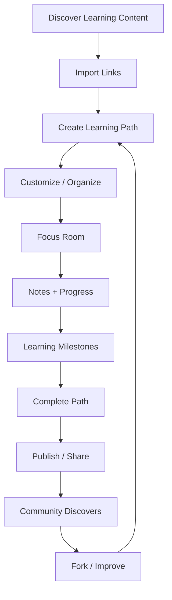
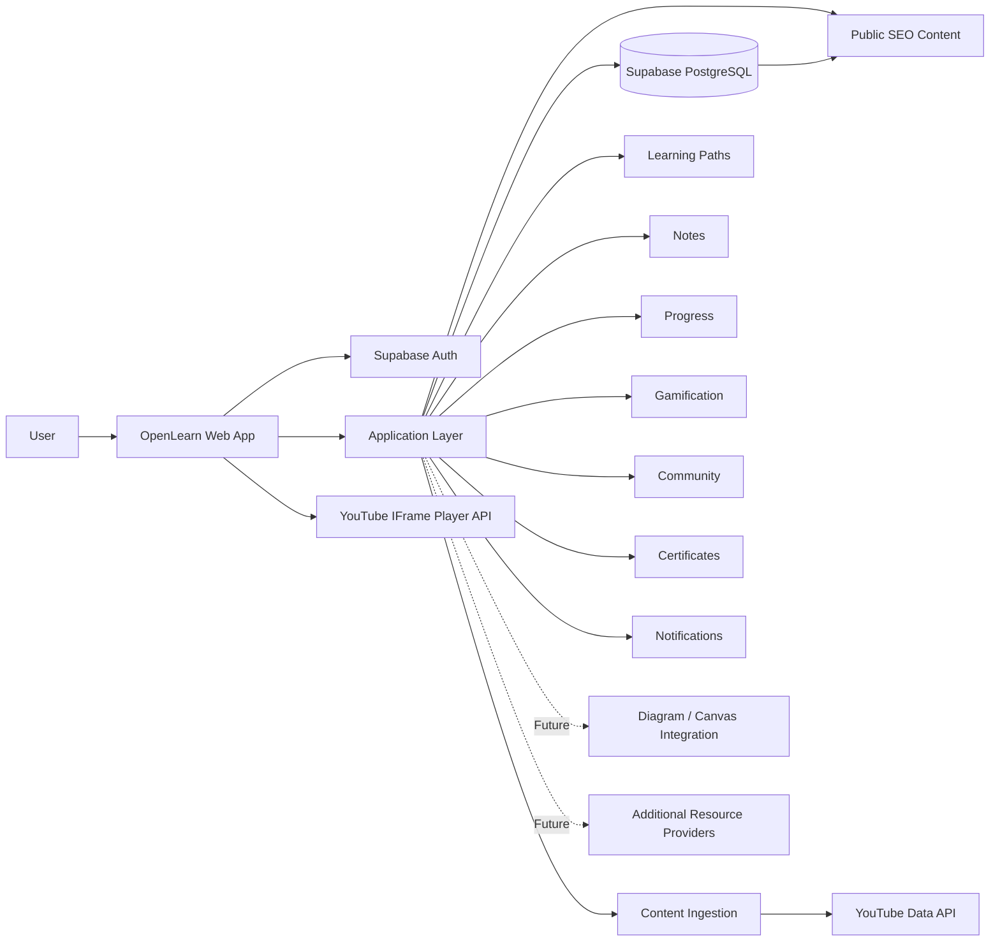
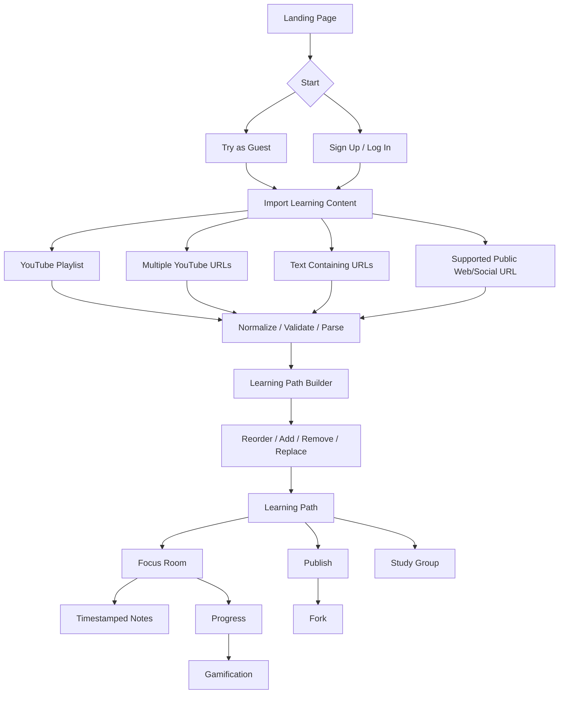
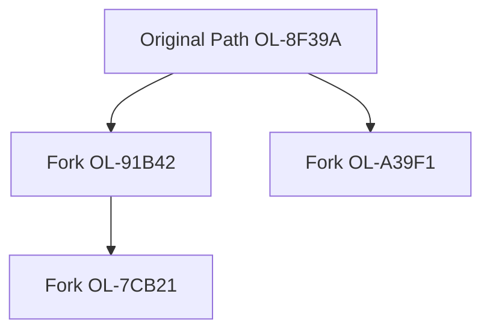
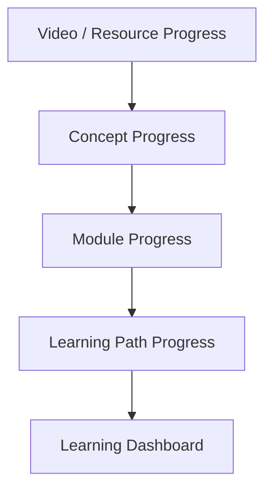
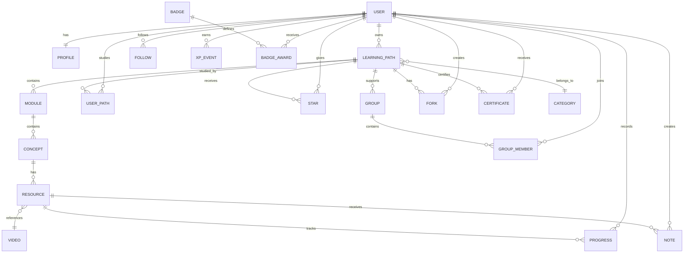
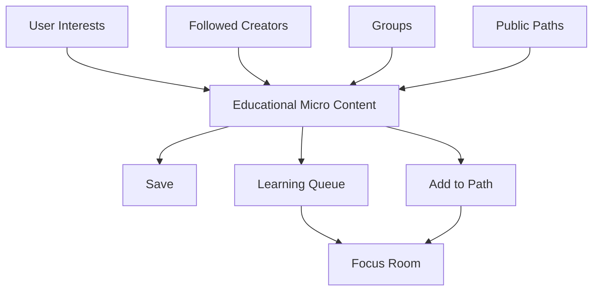
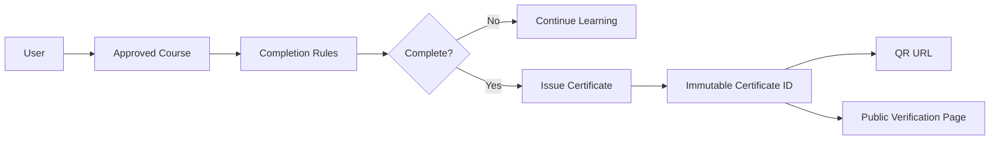

# OpenLearn — Product Requirements Document (PRD)

**Product:** OpenLearn  
**Document:** Product Requirements Document  
**Version:** 0.1  
**Owner:** Satya  
**Date:** 27 September 2026  
**Purpose:** GitHub-ready product definition for an open-source global learning platform

---

## 1. Executive Summary

**OpenLearn** is a global, open, community-driven learning platform built around one simple idea:

> **People should be able to bring the learning content they already found on the internet, turn it into a structured learning experience, and actually finish it.**

YouTube is the first and primary content source, but OpenLearn is not a YouTube clone and not simply an LMS. The core product is the **learning path**: a structured, editable, shareable and forkable curriculum assembled from YouTube and other internet resources.

A learner can paste a YouTube playlist, multiple YouTube links, text containing links, or a supported public web/social URL. OpenLearn parses the resources, creates a playlist/path, and lets the learner reorder, add, remove, replace and organize resources. A path can contain videos from multiple creators and can eventually represent the best explanation for each individual concept through primary and alternative resources.

The learning experience is delivered through a distraction-focused **Focus Room** with:

- YouTube embedded playback,
- automatic resume,
- timestamped notes,
- Markdown course notes,
- learning progress,
- streaks, XP, badges and challenges,
- study groups and group leaderboards,
- global leaderboards,
- profiles and follows,
- public learning paths,
- stars and forks,
- community feeds and notifications,
- approved-course certificates with QR verification,
- SEO-friendly public pages,
- and eventually educational micro-learning plus external visual-note integrations.

The long-term vision is to create an open ecosystem where people do not merely consume learning content; they **create, complete, improve, fork and share learning paths**.

---

# 2. Product Vision

## Vision Statement

> **Build a global open learning layer for internet knowledge where anyone can turn scattered educational content into a focused learning journey and improve that journey for the next learner.**

## Product Statement

> **OpenLearn is a focused, social and gamified learning platform where users can bring YouTube and other web resources into structured learning paths, customize and fork them, learn with progress and timestamped notes, study together, and publish community-created curricula.**

## Core Philosophy

1. **The learner chooses what to learn.**
2. **OpenLearn helps the learner finish it.**
3. **The community improves learning paths over time.**
4. **YouTube supplies content; OpenLearn supplies the learning environment.**
5. **Engagement should support learning, not recreate an entertainment feed.**

---

# 3. Problem Statement

Online educational content is abundant, but the learner often has to assemble the curriculum manually and then fight the distraction patterns of content platforms.

Typical journey:

```text
Search for topic
   ↓
Find playlist
   ↓
Find another creator
   ↓
Save another video
   ↓
Get distracted
   ↓
Lose sequence/context
   ↓
Start something else
   ↓
Never finish
```

OpenLearn changes the learning journey to:

```text
Learning Goal
   ↓
Learning Path
   ↓
Modules / Concepts
   ↓
Resources
   ↓
Focus Room
   ↓
Notes + Progress
   ↓
Gamification + Accountability
   ↓
Completion
   ↓
Community Contribution
```

---

# 4. What We Are Building

The central product object is the **Learning Path**.

```text
Learning Path
├── Modules
│   ├── Concepts
│   │   ├── Primary Resource
│   │   └── Alternative Resources
│   └── Concepts
└── Resources
```

A path can begin as a simple imported playlist and evolve into a full curriculum.

### Example

```text
Deep Learning
│
├── Mathematics
│   ├── Linear Algebra
│   ├── Probability
│   └── Calculus
│
└── Neural Networks
    ├── Perceptron
    ├── Activation Functions
    ├── Backpropagation
    │   ├── Creator A — Primary
    │   ├── Creator B — Alternative
    │   └── Creator C — Alternative
    └── Optimization
```

This is deliberately broader than a normal YouTube playlist.

---

# 5. Product Goals

## P0 Goals

### Focused learning
Provide a learning-first environment around embedded YouTube content without unrelated YouTube discovery surfaces inside the study experience.

### Easy curriculum creation
Allow users to build a learning path from a playlist, individual links, pasted text, and supported public web/social sources.

### Personal control
Allow users to reorder, add, remove, replace and annotate resources.

### Persistent learning
Remember progress, resume position, notes and learning paths for authenticated users.

### Gamified learning
Introduce XP, streaks, badges, challenges and leaderboards around eligible OpenLearn activities.

### Community
Enable public paths, profiles, following, stars, groups, feeds and notifications.

### Forking
Allow public learning paths to be forked, improved and republished with lineage.

### Trust and recognition
Issue platform certificates for approved OpenLearn courses, with verifiable public IDs and QR codes.

### SEO
Make public learning paths, categories, public profiles and certificate verification pages highly discoverable.

### Open source
Make the architecture, documentation and contribution model suitable for a public GitHub project.

---

# 6. Non-Goals

OpenLearn will not initially:

- host or redistribute YouTube video files,
- download YouTube videos for offline playback,
- become a full university or enterprise LMS,
- offer free general-purpose cloud storage,
- recreate YouTube's recommendation engine,
- become a generic social-video network,
- become a paid course marketplace,
- make AI the dependency of the core product.

Future AI, storage, diagram and other integrations are expansion layers.

---

# 7. Primary Personas

## Independent Learner
Wants to learn a subject using internet resources without losing focus or structure.

## Curator
Knows good resources from different creators and wants to assemble a better learning path.

## Study Group
Wants a shared curriculum, progress visibility and accountability.

## Community Contributor
Improves existing paths through better videos, better ordering, better notes or better concept structure.

## Platform-Curated Learner
Uses an approved OpenLearn course and wants a verifiable completion certificate.

---

# 8. Core Product Loop



The product should optimize for this loop rather than raw video consumption.

---

# 9. High-Level Architecture



---

# 10. User Experience Flow



---

# 11. Content Ingestion

## Supported inputs

### YouTube Playlist
A playlist URL is parsed into ordered resources using the YouTube Data API.

### Multiple YouTube Links
Users can paste any number of video links and create a new path.

### Pasted Text
The system extracts supported URLs from copied text.

### Supported Public Web/Social Link
A source-specific adapter can extract YouTube links from supported public pages such as a public LinkedIn post, subject to the source's access rules and technical availability.

### Ingestion rules

- normalize URL formats,
- validate resources,
- deduplicate videos,
- collect metadata,
- retain source attribution,
- preserve import order,
- show failures clearly,
- allow manual correction.

### External source architecture

```text
Input
  ↓
Source Classifier
  ↓
Provider Adapter
  ↓
Resource Extractor
  ↓
Normalizer
  ↓
Deduplicator
  ↓
Metadata Resolver
  ↓
Learning Path Draft
```

The provider abstraction is important so that the product can expand beyond YouTube later.

Sources:

- https://developers.google.com/youtube/v3/docs/playlistItems
- https://developers.google.com/youtube/v3/docs/videos/list

---

# 12. Learning Path Builder

Users can:

- create a path,
- rename it,
- add a description,
- choose categories,
- reorder resources,
- add new resources,
- remove resources,
- replace resources,
- create modules,
- create concepts,
- add alternative resources,
- preview the path,
- keep it private,
- publish it,
- share it by stable ID.

Every path receives an immutable ID.

Example:

```text
OL-8F39A
```

Example public URL:

```text
https://openlearn.org/path/OL-8F39A
```

---

# 13. Forking and Version Lineage

Forking is inspired by GitHub.



Each fork should preserve:

- source path ID,
- fork creator,
- fork timestamp,
- parent version,
- version lineage.

A fork is independently editable and publishable.

The original path is never modified by editing a fork.

---

# 14. Concept-Level Alternatives

A concept can hold multiple resources.

```text
Backpropagation
├── Primary: Creator A
├── Alternative: Creator B
└── Alternative: Creator C
```

The learning state belongs primarily to the concept and path rather than only to one video.

This enables a learner to switch explanations without rebuilding the curriculum.

---

# 15. Focus Room

The Focus Room is the core learning interface.

```text
+--------------------------------------------------------------+
| OPENLEARN                                      Progress 68% |
+--------------------------------------+-----------------------+
|                                      | Learning Path         |
|              VIDEO                   |                       |
|              PLAYER                  | ✓ Introduction        |
|                                      | ✓ Fundamentals        |
|                                      | ▶ Backpropagation     |
|                                      | ○ Optimization        |
|                                      | ○ CNN                 |
+--------------------------------------+-----------------------+
| Notes | Course Notes | Resources     |                       |
|                                      |                       |
| 18:37 Gradient intuition             |                       |
| 24:08 Important equation             |                       |
+--------------------------------------+-----------------------+
```

The Focus Room should:

- keep the learner's active path visible,
- provide the embedded player,
- show current/next lesson,
- show progress,
- provide note-taking access,
- resume the previous position,
- avoid unrelated social/discovery feeds.

YouTube IFrame API:

https://developers.google.com/youtube/iframe_api_reference

---

# 16. Timestamped Notes

When the learner pauses at 18:37 and adds a note:

```text
18:37 — Gradient tells us how much each parameter contributed to error.
```

Store the precise position as seconds:

```text
timestamp_seconds = 1117
```

Clicking the note should return the player to 1117 seconds.

Notes must support:

- timestamp,
- Markdown/text,
- resource/video,
- concept,
- path,
- author,
- created time,
- updated time.

---

# 17. Course and Lesson Notes

Initial note storage is text/Markdown.

Course-level notes may contain:

- learning objectives,
- summaries,
- references,
- code,
- checklists,
- architecture diagrams represented by Markdown/links,
- personal reflections.

Future integrations can connect to external diagram/canvas tools such as Excalidraw or another suitable provider. The external tool must remain optional.

---

# 18. Progress Model



Users should see:

- current position,
- completed resources,
- remaining resources,
- concept completion,
- module completion,
- overall path progress,
- last activity,
- learning milestones.

Progress and certification are separate concepts.

---

# 19. Guest Mode

Guest mode is a first-class experience.

Guests can:

- import a playlist,
- paste links,
- reorder resources,
- watch in Focus Room,
- create temporary notes,
- experience basic progress.

Account-required persistence:

- cross-device progress,
- history,
- streaks,
- badges,
- groups,
- follows,
- stars,
- public publishing,
- certificates.

The conversion moment should be:

> **Save your learning journey.**

---

# 20. Authentication and Authorization

Primary backend candidate: **Supabase**.

Use:

- Supabase Auth,
- PostgreSQL,
- Row Level Security,
- database migrations,
- server-side protected credentials.

Initial auth providers:

- email/password,
- magic link,
- Google.

Future:

- GitHub,
- Microsoft,
- additional providers.

Sources:

https://supabase.com/docs/guides/auth
https://supabase.com/docs/guides/database/postgres/row-level-security

---

# 21. Database Design



## Core domains

```text
Identity
Profiles
Learning Paths
Modules
Concepts
Resources
YouTube Metadata
Progress
Notes
Groups
Followers
Stars
Forks
Feeds
Notifications
Gamification
Challenges
Certificates
Categories
Moderation
Audit
```

Database principles:

- normalize reusable video metadata,
- store ordering in path relationships,
- isolate private user data,
- preserve immutable certificate identity,
- preserve fork lineage,
- use UTC timestamps,
- use foreign keys and constraints,
- use RLS,
- use migrations in source control,
- keep gamification as an auditable event ledger.

---

# 22. Gamification

OpenLearn should provide a rich learning game layer.

Potential mechanics:

- XP,
- levels,
- streaks,
- badges,
- challenges,
- weekly goals,
- group challenges,
- curator reputation,
- contributor reputation,
- completion milestones,
- seasonal community events.

Rewards should be tied to eligible OpenLearn learning/contribution actions and not directly used as incentives for restricted YouTube engagement.

YouTube Developer Policies:

https://developers.google.com/youtube/terms/developer-policies

---

# 23. Streaks

A streak represents consistent learning activity on OpenLearn.

```text
Mon ✓
Tue ✓
Wed ✓
Thu ✓
Fri ✓
Sat ✓
Sun ✓
```

Future capabilities:

- streak freeze,
- recovery day,
- group streak,
- milestone rewards.

---

# 24. Community

Community is a core product pillar.

Users can:

- create public paths,
- star paths,
- fork paths,
- improve paths,
- follow users,
- join groups,
- create groups,
- publish learning notes where appropriate,
- receive notifications,
- discover learning content by category.

---

# 25. Following and Feed

A user can follow another user.

The feed can include meaningful activities such as:

```text
Creator published a learning path.
Creator improved a path.
Creator forked a popular path.
A group started a learning program.
A learner completed a public approved course.
```

Initial feed ranking should be simple and explainable. Personalization can be introduced later.

---

# 26. Stars

A **Star** is OpenLearn's GitHub-inspired save/endorsement action for learning paths.

A user can:

- star a path,
- remove a star,
- view starred paths on their profile.

Star counts can support public discovery.

---

# 27. Study Groups

A group selects a shared learning path.

Example:

```text
Machine Learning — October Cohort

42 Members
Shared Path: Machine Learning Foundations
Target: 31 October
```

Group features:

- invite/join,
- shared learning path,
- member progress,
- group progress,
- leaderboard,
- group challenges,
- announcements,
- group activity.

---

# 28. Global Leaderboard

Views:

- weekly,
- monthly,
- all-time,
- category,
- curator,
- contributor,
- groups.

Scoring must be transparent and must not be based simply on rewarded YouTube engagement.

---

# 29. Educational Micro-Learning

OpenLearn should eventually have a dedicated short educational feed.

The purpose is discovery and lightweight learning, not endless entertainment.



Important distinction: YouTube Shorts and generic short educational videos are not necessarily the same thing. The feed should support educational micro-content regardless of whether the source is formally classified as a YouTube Short.

---

# 30. Certificates

Selected OpenLearn courses can be marked as platform-approved.

After all course completion requirements are satisfied, the platform can issue a certificate.

```text
OPENLEARN
Certificate of Completion

Learner: Satya
Course: Machine Learning Foundations
Completed: 27 September 2026
Certificate ID: OL-CERT-8F39A
```

Verification:

```text
https://openlearn.org/certificate/OL-CERT-8F39A
```

QR code should encode the verification URL.

The certificate must clearly state that it is an **OpenLearn-issued certificate of completion** and must not imply accreditation that the platform does not actually possess.

---

# 31. Certificate Architecture



---

# 32. SEO and Public Discovery

SEO is a first-class product feature.

Potential public pages:

```text
/paths/machine-learning-foundations
/paths/system-design-for-backend-engineers
/categories/artificial-intelligence
/users/satya
/certificates/OL-CERT-8F39A
```

Requirements:

- server-rendered public pages,
- canonical URLs,
- metadata,
- Open Graph,
- structured data where appropriate,
- sitemap,
- robots.txt,
- category pages,
- public profiles,
- public certificate verification,
- internal linking,
- mobile performance.

---

# 33. Search

Search should support:

- learning paths,
- users,
- categories,
- groups,
- concepts,
- indexed resources.

Start with PostgreSQL search; introduce specialized search infrastructure only when scale requires it.

---

# 34. Notifications

### Learning

- milestone,
- streak,
- group activity,
- course completion,
- certificate issued.

### Social

- followed creator published a path,
- path starred,
- follow event,
- group invite,
- meaningful fork activity.

### Preferences

Users should be able to control notification channels and types.

---

# 35. Moderation

Community-created learning content requires moderation.

Users can report:

- spam,
- inappropriate content,
- malicious links,
- misleading claims,
- abuse,
- copyright concerns.

Moderators can:

- review,
- hide,
- quarantine,
- remove,
- restore,
- warn,
- suspend.

Every administrative action affecting public content should be auditable.

---

# 36. Security Requirements

Required from the beginning:

- secure authentication,
- PostgreSQL RLS,
- input validation,
- URL validation,
- SSRF protection,
- Markdown sanitization,
- XSS protection,
- CSRF protection,
- rate limiting,
- brute-force protection,
- secrets management,
- audit logs,
- role separation,
- account deletion,
- privacy controls.

Arbitrary URL ingestion is a security-sensitive component and must be isolated.

---

# 37. Privacy

OpenLearn should store only what the product needs.

Initial data includes:

- account identity,
- profile,
- interests,
- learning paths,
- progress,
- notes,
- stars,
- follows,
- groups,
- achievements,
- certificates,
- notifications.

Users should control the visibility of learning activity and be able to delete their account and personal content according to the product's retention policy.

---

# 38. Accessibility

The web product should target strong accessibility practices:

- keyboard navigation,
- semantic HTML,
- accessible forms,
- screen-reader labels,
- visible focus states,
- sufficient contrast,
- keyboard alternative to drag/drop,
- captions where available,
- reduced motion support.

---

# 39. Performance

High-priority surfaces:

1. Landing page
2. Public path page
3. Dashboard
4. Focus Room
5. Path Builder

Use:

- server rendering where useful,
- optimized images,
- caching,
- batched API calls,
- efficient database indexes,
- lazy loading of noncritical UI.

---

# 40. YouTube Dependency and Policy Guardrails

YouTube is a critical provider dependency.

OpenLearn should:

- use official YouTube APIs/player mechanisms,
- preserve required YouTube attribution/branding,
- avoid downloading or extracting video/audio,
- avoid prohibited modifications to the player,
- not promise suppression of YouTube-served advertising,
- not provide rewards for prohibited YouTube engagement.

YouTube IFrame API:
https://developers.google.com/youtube/iframe_api_reference

YouTube policies:
https://developers.google.com/youtube/terms/developer-policies

Embedded video advertising:
https://support.google.com/youtube/answer/132596

Product wording should be:

> **Ad-free OpenLearn interface**

not a claim that the platform can suppress YouTube's own embedded advertising.

---

# 41. MVP Scope

The MVP should already feel like the real OpenLearn product.

## Identity

- guest mode,
- sign up,
- login,
- profile,
- interests.

## Learning

- playlist import,
- multiple YouTube URL import,
- text link extraction,
- metadata parsing,
- duplicate detection,
- editable path,
- drag-and-drop ordering,
- add/remove/replace,
- stable path ID.

## Focus Room

- embedded YouTube player,
- resume position,
- lesson navigation,
- progress,
- timestamped notes,
- Markdown course notes.

## Gamification

- XP ledger,
- streak,
- badges,
- basic challenges,
- personal gamification dashboard,
- global leaderboard.

## Community

- public paths,
- stars,
- public profiles,
- follows,
- basic feed,
- groups,
- group progress,
- group leaderboard.

## Forking

- fork public path,
- modify fork,
- publish fork,
- show lineage.

## Certificates

- approved-course state,
- completion rules,
- certificate ID,
- public verification,
- QR.

## SEO

- public path pages,
- category pages,
- public profiles,
- certificate pages,
- sitemap.

---

# 42. P1 Expansion

- concept-level alternatives,
- deeper curriculum modeling,
- public LinkedIn/web adapters,
- educational micro-learning feed,
- richer feed,
- notifications,
- advanced search,
- contributor reputation,
- stronger moderation tooling,
- advanced challenges,
- community path quality signals.

---

# 43. P2 Expansion

- AI-assisted curriculum creation,
- AI-generated assessments,
- external diagram/canvas integrations,
- Google Drive integration,
- additional content providers,
- localization,
- mobile apps,
- advanced learning analytics.

---

# 44. Open-Source Repository Strategy

Recommended repository:

```text
openlearn/
├── apps/
│   └── web/
├── packages/
│   ├── ui/
│   ├── auth/
│   ├── database/
│   ├── youtube/
│   ├── learning/
│   ├── community/
│   └── shared/
├── supabase/
│   ├── migrations/
│   ├── functions/
│   └── seed/
├── docs/
│   ├── PRD.md
│   ├── ARCHITECTURE.md
│   ├── DATABASE.md
│   ├── SECURITY.md
│   ├── GAMIFICATION.md
│   ├── COMMUNITY.md
│   ├── YOUTUBE_INTEGRATION.md
│   ├── CERTIFICATES.md
│   ├── SEO.md
│   └── ADR/
├── tests/
├── .github/
│   ├── workflows/
│   ├── ISSUE_TEMPLATE/
│   └── PULL_REQUEST_TEMPLATE.md
├── README.md
├── CONTRIBUTING.md
├── CODE_OF_CONDUCT.md
└── LICENSE
```

The project should be contribution-ready from the beginning.

---

# 45. Recommended Engineering Principles

- modular monolith first,
- strict typing,
- migration-first database development,
- reusable domain modules,
- API contracts under version control,
- automated tests,
- CI/CD,
- security checks,
- observable production behavior,
- documented ADRs,
- no unnecessary microservices.

The system should be able to evolve from thousands to millions of users without requiring a complete domain-model rewrite.

---

# 46. Product Metrics

## North Star

> **Weekly Learning Completions**

Supporting metrics:

- first path created,
- first Focus Room session,
- first note,
- concept completion,
- path completion,
- active learning days,
- group participation,
- public path creation,
- stars,
- forks,
- follows,
- certificates issued,
- D7 learning retention,
- D30 learning retention.

Raw YouTube watch time should not be the primary north-star metric.

---

# 47. Key Risks

## YouTube dependency
Policy or API changes can affect the product.

**Mitigation:** isolate provider integration behind an adapter layer.

## Video availability
Videos can disappear or become restricted.

**Mitigation:** health checks, broken-resource states and replacement flows.

## Community spam
Public publishing can create low-quality paths.

**Mitigation:** moderation, stars/forks as signals, reports, reputation and discovery controls.

## Link ingestion security
Public URL ingestion can introduce SSRF and abuse vectors.

**Mitigation:** adapters, validation, allowlists, timeouts and isolation.

## Gamification abuse
Users may attempt to optimize points instead of learning.

**Mitigation:** transparent scoring, rate limits, milestone-based rewards and separate learning state from XP.

---

# 48. Competitive Context

The competitive section is included to understand the market, not to define the product.

## Focus Room
https://focusroom.club/

Relevant overlap:

- distraction-free YouTube learning,
- playlist/course organization,
- progress,
- notes.

## SyncStudy
https://www.syncstudy.in/

Relevant overlap:

- YouTube learning,
- structured courses,
- progress,
- timestamped notes,
- study workflows.

## QuestXP
https://www.questxp.in/

Relevant overlap:

- YouTube learning,
- gamification,
- XP,
- streaks,
- missions,
- leaderboards.

## UnplugLearn
https://unpluglearn.com/

Relevant overlap:

- focused YouTube learning,
- playlists,
- progress,
- notes.

## YTCourse
https://ytcourse.com/

Relevant overlap:

- YouTube playlist-to-course conversion,
- structured learning,
- quizzes,
- progress,
- certificates.

### What OpenLearn is intentionally trying to build beyond the common pattern

```text
YouTube Content
      ↓
Focused Player
      ↓
Progress

                versus

Internet Resources
      ↓
Learning Path
      ↓
Modules / Concepts
      ↓
Multiple Explanations
      ↓
Focus Room
      ↓
Notes
      ↓
Progress
      ↓
Gamification
      ↓
Groups
      ↓
Community
      ↓
Stars
      ↓
Forking
      ↓
Better Community Curriculum
      ↓
Certificates + Verification
```

The intended product distinction is therefore not one isolated feature. It is the combination of **learner-created curriculum, community curation, concept-level alternatives, social learning, forkable paths, and verified completion** around open internet learning content.

---

# 49. Final Product Definition

> **OpenLearn is a global open learning platform where anyone can turn YouTube and other internet resources into structured learning paths, customize and fork those paths, learn in a focused environment with timestamped notes and progress, participate in gamification and study groups, follow and learn from a community, and publish better learning paths for everyone.**

---

# 50. Final Product Principle

> **Do not build another place where people consume content. Build a place where people finish learning — and then help the next learner finish faster.**

---

# Appendix A — Primary External Sources

- YouTube Developer Policies: https://developers.google.com/youtube/terms/developer-policies
- YouTube Developer Policy Guide: https://developers.google.com/youtube/terms/developer-policies-guide
- YouTube IFrame Player API: https://developers.google.com/youtube/iframe_api_reference
- YouTube Playlist Items API: https://developers.google.com/youtube/v3/docs/playlistItems
- YouTube Videos API: https://developers.google.com/youtube/v3/docs/videos/list
- YouTube Embedded Video Ads: https://support.google.com/youtube/answer/132596
- YouTube Shorts: https://support.google.com/youtube/answer/15424877
- Supabase Auth: https://supabase.com/docs/guides/auth
- Supabase PostgreSQL: https://supabase.com/docs/guides/database/overview
- Supabase RLS: https://supabase.com/docs/guides/database/postgres/row-level-security

# Appendix B — Competitive References

- Focus Room: https://focusroom.club/
- SyncStudy: https://www.syncstudy.in/
- QuestXP: https://www.questxp.in/
- UnplugLearn: https://unpluglearn.com/
- YTCourse: https://ytcourse.com/
